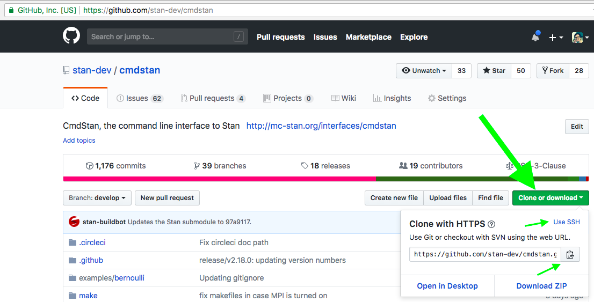
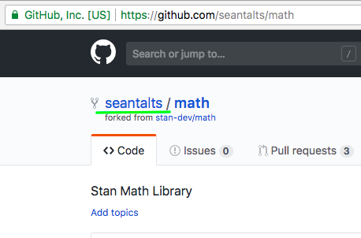
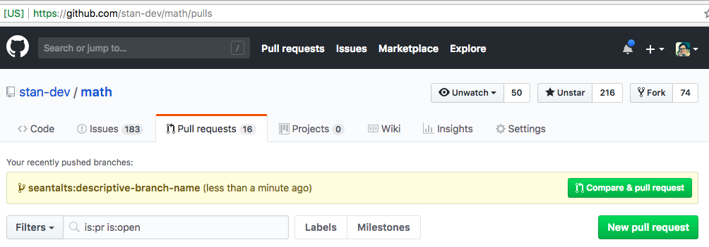
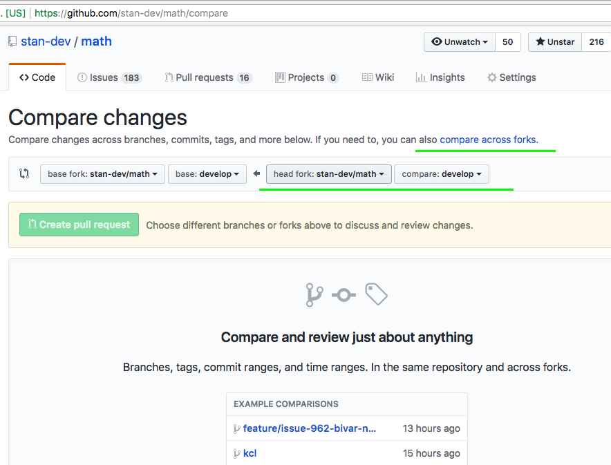
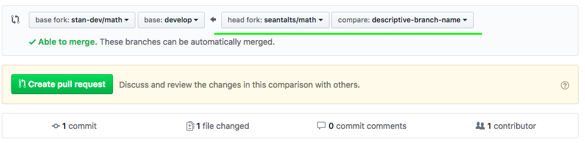
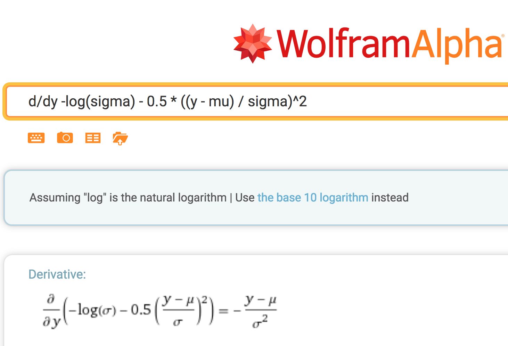

```{r setup, include = FALSE, warning = FALSE, cache = TRUE, echo = FALSE, comment = ""}
```

```{r echo = FALSE, include = FALSE}
library(knitr)
library(ggplot2)
```

<style>
.gdbar img {
  background-color: transparent;
  color: transparent;
  width: 150px !important;
  height: 150px !important;
  margin: 8px 8px;
}

.gdbar {
  background-color: transparent;
  color: transparent;
  width: 400px !important;
  height: 170px !important;
}

.prettyprint {
  padding: 0 0 0 5em;
  background-color: #f9f9f9;
}
slides > slide:not(.nobackground):before {
  width: 0px;
  height: 0px;
  background-size: 0px 0px;
}

li {
  font-family: verdana, lucida sans unicode;
  font-size: 24px;
  line-height: 1.45em;
}
pre {
  font-family: lucida console, monaco, menlo;
  font-size: 20px;
  line-height: 1.5em;
  font-weight: 500;
  background-color: #f9f9f9;
}
tt {
  font-family: monaco; lucida console;
  font-size: 24px;
}
code {
  font-family: monaco; lucida console;
  font-size: 24px;
  background-color: #f9f9f9;
}
</style>

## Slides online

* http://mc-stan.org/workshops/cppFunctions2018/stan-cpp.html

# Part I: Introduction

## Online documentation
* `stan-dev/stan`: [Developer process overview](https://github.com/stan-dev/stan/wiki/Developer-process-overview)
* `stan-dev/stan`: [Contributing new functions to Stan](https://github.com/stan-dev/stan/wiki/Contributing-New-Functions-to-Stan) <br /> <br />
* `stan-dev/math`: [Adding a new function with known gradients](https://github.com/stan-dev/math/wiki/Adding-a-new-function-with-known-gradients)
* `stan-dev/math`: [Developer doc](https://github.com/stan-dev/math/wiki/Developer-Doc)


## Best and worst decisions for Stan?
<blockquote>
* We were asked at a conference, <br /> <br />
"What are the **best and worst decisions** you made regarding the implementation of Stan?"

* We answered
    - *Worst decision*: using C++
    - *Best decision*: using C++


## Why C++?
* It's **very powerful**
* A whole *new language with C++11* and beyond
* Performant *matrix and math libs* (like Fortran, unlike all else)
* *Control of memory* for autodiff arena (collect once w/o destructors)
* *Template overloads* for autodiff of templated C++ code
* *Static evaluation* of branchpoints (traits metaprograms)
* *Unfolding* code (recursive metaprograms)
* *Elimination of intermediates* (expression templates)
* *Native in-memory communication* with Python and R
* *Binary builds* allow native code releases (e.g., RStanArm)
* *Optimizing compilers* are very good

## Why *not*&nbsp; C++?
* it's **not the easiest language** in the world
* the spec is incomplete by design so *compilers vary*, even by optimization level
* it's been a *moving target* from C++03 to C++20
* low-level memory access and pointers makes it *dangerous*
* *binary builds* and distribution are a pain to manage
* *compile time* is disastrous with templating & optimization
    - we're working to correct this
    
# Part II: Stan's Code
    
## Top level Stan architecture
* A model in the Stan language is translated into a C++ model class
* C++ model class relies on and includes the Stan *math library*
* C++ model class compiled in a single *translation unit* with algorithms and math library
    - this will change in near future with separate translation units
* Result is *executable* (CmdStan) or *dynamically linkable* object code (RStan, PyStan)

## Stan program is translated to a C++ class
* Creates a C++ model class with fixed *concept* (C++ interface)
* Model class is *constructed with data*
* Implements a *function of continuous unconstrained parameters*
* *Data* may be discrete and/or continuous
* *Generated quantities* may be discrete and/or continuous
    
## Stan C++ class (continued)
* `log_prob` method on the model concept is key
    - applies to vector of *unconstrained parameters* (for algorithms)
    - returns *log posterior* (up to additive constant)
    - usually *coded as joint log density* with posterior via Bayes's rule
    - or *log penalized likelihood* for maximum likelihood
        - turns off Jacobian correction
* *Constrain and unconstrain* parameters
    - from constrained to unconstrained for initialization
    - from unconstrained to constrained to evaluate model block
    - log Jacobian for change of variables in unconstrained to constrained
* Produces *transformed parameters* and *generated quantities*


## The Stan to C++ translator
* Known as the compiler, parser, or transpiler
* Translates Stan program to *C++ class*
* Written in C++ (with *Boost Spirit Qi* parser)
* All *code* in `<stan>/src/stan/lang`
    - parallel to I/O, inference algorithms, service, and memory directories
    - top-level call in `<stan>/src/stan/lang/compiler.hpp`
* Transpiler consists of
    - *parser and semantic actions* (`lang/grammars`): translate Stan to AST
    - *abstract syntax tree* (AST) (`lang/ast`): C++ representation of code
    - *generator* (`lang/generator`): convert AST to C++ code
 

## Built-in Stan functions
* Defined using C++ in the math library
    - definitions may *use autodiff*
    - or may *define gradients analytically* for efficiency
* Exposed in the Stan language
    - all that is needed is *addition of signatures* to symbol table
    - needed because Stan is *strongly statically typed*

## C++ Model Compiled to Object Code
* Includes the math library (using `#include`)
    - Stan functions defined in math library
    - some functionality directly in `stan/src`, such as transforms
* Compiled largely *header-only* as a single translation unit
    - includes Stan model class (translated from Stan to C++)
    - Stan inference algorithms (MCMC, variational inference, optimization)
    - Stan services (front-end to Stan used by interfaces RStan, PyStan, CmdStan)
        - other interfaces call CmdStan directly
* *Exclusions* from header-only
    - parallel libaries (threading, MPI, and GPU)
    - ordinary differential equation solvers (from Sundials lib)


## CmdStan, RStan, PyStan
* These are the three *primitive interfaces*
    - other interfaces (Julia, Stata, MATLAB, Mathematica) *call CmdStan*
    - ScalaStan is its own *embedded language* that transpiles to a Stan program
* We'll be concentrating on the command line interface, CmdStan
* The interfaces *implement callbacks* for
    - interrupts
    - data input
    - data and diagnostic output
    - runtime console messages


## Stan GitHub Repository Structure
* All repos for Stan are in the `stan-dev` *GitHub organization*
* *Git submodule* structure
    - `cmdstan` includes `stan` (path `stan`)
    - `stan` includes `math` (path `lib/stan_math`)
* From CmdStan perspective
    - Stan is at `stan`
    - Math lib is at `stan/lib/stan_math`
    - Other libs at `stan/lib/stan_math/lib`
    
## Other libraries
* Math library copies several external libs into its source tree (path `lib`), including
    - Boost (general C++, math, RNG, stats parser)
    - Eigen (matrix arithmtic and linear algebra)
    - Sundials (ordinary differential equation solvers)
    - OpenCL (GPU calculations)
    - googletest (C++ test framework)

## A Stan Program
* `Matrix program(Matrix data) {...}`
    - Function from data to a sample of parameter draws typical given that data and model
* Compiled with a few algorithms that use the model density to find typical parameter draws
* Most of the complexity lies in the likelihood, which is built using functions in the Math library


## Most of Stan's *code* is in the Math library
* Provides users with many functions to express complicated likelihoods
* Autodiff system gives the algorithms the gradients they need automatically for any Stan or Math library code
* Split first into `stan` and `test`
* Stan split into `math`
* Split by container type: `scal`, `arr`, `mat` (this is going away)
* Split by functionality: `err`, `fun`, `meta`, `prob`, ...
    - e.g., from CmdStan:
    - `stan/lib/stan_math/stan/math/rev/scal/fun/log1p.hpp`
    
## Tests and continuous integration
* We use [googletest](https://github.com/google/googletest), a C++ testing framework for unit tests
    - test files *end in* `_test.cpp`
    - *macros* like `TEST(SuiteName, TestName)` and `EXPECT_EQ(actual, expected)`
* Test *directory structure* parallel to `src` stucture
* *Run tests locally* with `runTests.py` helper script on a directory or test
* *Jenkins* continuous integration server
    - at http://d1m1s1b1.stat.columbia.edu:8080/
    - Specified in code, in a top-level file named `Jenkinsfile`
* [This wiki](https://github.com/stan-dev/stan/wiki/Supported-C---Compilers-and-Language-Features) describes the OSs and toolchains tested

    
# Part III: Process

## Developer process
0. For *larger changes only*: Discourse discussion and/or design review
1. *GitHub issue* describing the problem (i.e., functional specification)
2. Add a description of the *proposed technical solution* to the GitHub issue
3. Code the solution *on a branch*
4. Create a *GitHub pull request* with *BSD license details*
    - developers maintain copyright, but must BSD license contributions before approval
5. [Code review](https://github.com/stan-dev/math/wiki/Developer-Doc#code-review-guidelines)
    - if changes requested, return to (3)
5. *Merge* only after approval and the tests pass on Jenkins

## Setting up GitHub
* Create an account
* (optional) [Set up SSH keys](https://help.github.com/articles/connecting-to-github-with-ssh/)
* *Fork the relevant repositories* from the `stan-dev` organization
* `git clone --recursive <cmdstan repo>`
    - the recursive bit takes care of submodules
* *Add your fork as a remote* on the repo you care about

## Clone CmdStan
```{r, echo=F, out.width = "100%"}

```

## Fork Math repo
```{r, echo=F, out.width = "100%"}

```

## My fork 


## Set up fork as remote in local clone of CmdStan
```
$ git remote -v
origin	git@github.com:stan-dev/math.git (fetch)
origin	git@github.com:stan-dev/math.git (push)

$ git remote add sean git@github.com:seantalts/math.git

$ git remote -v
origin	git@github.com:stan-dev/math.git (fetch)
origin	git@github.com:stan-dev/math.git (push)
sean	git@github.com:seantalts/math.git (fetch)
sean	git@github.com:seantalts/math.git (push)
```

## Creating a pull request (PR)
Fairly *standard open source flow*:

1. (optional) create a branch
1. write code, tests, and doc
1. run appropriate checks - cpplint, appropriate unit tests, (optional) `clang-format`
1. add files
1. commit with a [message about what you were trying to accomplish](https://chris.beams.io/posts/git-commit/) 
1. `git push origin <branchname>`
1. open pull request on appropriate `stan-dev` repo

## Creating a branch
```
$ git checkout -b descriptive-branch-name
Switched to a new branch 'descriptive-branch-name'
```

## A complicated example
```
$ cd <math clone>
$ find . -name operands_and_partials.hpp

./stan/math/fwd/mat/meta/operands_and_partials.hpp
./stan/math/fwd/scal/meta/operands_and_partials.hpp
./stan/math/prim/mat/meta/operands_and_partials.hpp
./stan/math/prim/scal/meta/operands_and_partials.hpp
./stan/math/rev/mat/meta/operands_and_partials.hpp
./stan/math/rev/scal/meta/operands_and_partials.hpp
```

## Some tests from the example
```
$ cd ~/scm/cmdstan/stan/lib/stan_math
$ find . -name operands_and_partials_test*
./test/unit/math/fwd/mat/meta/operands_and_partials_test.cpp
./test/unit/math/fwd/scal/meta/operands_and_partials_test.cpp
./test/unit/math/mix/mat/meta/operands_and_partials_test.cpp
./test/unit/math/prim/scal/meta/operands_and_partials_test.cpp
./test/unit/math/rev/mat/meta/operands_and_partials_test.cpp
```

## Google test
`test/unit/math/rev/mat/meta/operands_and_partials_test.cpp`
```{c, eval=FALSE, echo=TRUE}
TEST(AgradPartialsVari, OperandsAndPartialsVec) {
  ...
  vector_d d_vec(4);
  operands_and_partials<vector_d> o3(d_vec);
  EXPECT_EQ(6, sizeof(o3));
  ...
  EXPECT_FLOAT_EQ(10.0, v.val());
  EXPECT_FLOAT_EQ(10.0, grad[0]);
}

```


## Running the checks
1. `python runTests.py -j<num_cores> path/to/test.cpp /path/to/test/dir`
1. `make cpplint` - runs a python script that [checks style](https://github.com/stan-dev/stan/wiki/Coding-Style-and-Idioms)

## Autoformatting
* Project standardized on formatting for readaibility and to avoid arguments
* Uses `clang-format` to automatically format code
* Jenkins is set up to do this automatically on PRs and commit back to your branch
    - So if you get an email about this, you can `git pull` to incorporate those formatting fixes
* Once `clang-format` is installed, you can install a git hook to run it on any files you commit:
    - (from Math repo) `$ bash hooks/install_hook.sh`
* https://github.com/stan-dev/stan/wiki/Coding-Style-and-Idioms#clang-format

## Add, commit, push
```
$ git add test/unit/math/rev/mat/meta/operands_and_partials_test.cpp
$ git commit -m "Informative message..."
$ git push sean descriptive-branch-name
```

## PR step 1
```{r, echo=F, out.width = "100%"}

```

## PR step 2
```{r, echo=F, out.width = "100%"}

```

## PR step 3
```{r, echo=F, out.width = "100%"}

```

## Stan release process
1. *Pull requests* ask for code to be added to the `develop` branch
    - `develop` is maintained in a releasable state at all times
1. Choose a point in time along the `develop` branch and *tag it with version number*
    - semantic versioning:  Major.Minor.Patch
    - only *major* changes *break backward compatibility*
    - *minor* numbers indicate new functionality
    - *patch* incremented for bugfix-only releases
1. We then *merge that tag* into the `master` branch
    - makes sure `master` is always stable
    - and always pointing at latest release
1. Additional processes used for hotfix patch releases


# Part IV: Coding Functions<br />in Stan

## Coding a distribution in Stan

- Use the Stan language to code the normal log pdf with `_lpdf` suffix
```stan
functions {
  real my_normal_lpdf(real y, real mu, real sigma) {
    return -0.5 * log(2 * pi())          // params: { }
           - 2 * log(sigma)               // params: { sigma }
           - 0.5 * ((y - mu) / sigma)^2;  // params: { y, mu, sigma }
  }
}
parameters { 
  real y;
}
model {
  y ~ my_normal(1.5, 3.2);
}
```

## What's missing?

- Input validation!

- Implement in Stan with the `reject` function

```stan
if (sigma < 0 || is_nan(sigma) || is_inf(sigma))
  reject("sigma must be finite, positive, found sigma = ", sigma);

if (is_nan(y) || is_inf(y))
  reject("y must be finite, found y = ", y);

if (is_nan(mu) || is_inf(mu))
  reject("mu must be finite, found mu = ", mu);
```

## Restrictions on Stan functions

* Not polymorphic---they work for a single signature
    - can't duplicate library function vectorization
    - overloading is coming, but will require multiple definitions
    
* No traits branching
    - can't skip constant terms determined by type analysis
    - hope to add this, too    


## Compiling model in CmdStan
* Model placed in `~/temp2/my-normal.stan`;  `stanc` is transpiler
* compiled *without optimization* at `-O0` for compile speed
```
$ cd ~/cmdstan
~/cmdstan(develop)$ git pull
...
~/cmdstan(develop)$ make stan-update
...
~/cmdstan(develop)$ make -j5 O=0 ~/temp2/my-normal
    ...transpiler built on first call with 5 processes...
--- Translating Stan model to C++ code ---
bin/stanc  /Users/carp/temp2/my-normal.stan --o=/Users/carp/temp2/my-normal.hpp
Model name=my_normal_model
Input file=/Users/carp/temp2/my-normal.stan
Output file=/Users/carp/temp2/my-normal.hpp
--- Linking C++ model ---
c++ -Wall -I . -isystem stan/lib/stan_math/lib/eigen_3.3.3 ... -O0 ...
```

## Sampling from posterior in CmdStan

* Use make target as executable; writes draws to `output.csv` by default
```
~/cmdstan(develop)$ cd ~/temp2

~/temp2$ ~/temp2$ ./my-normal sample num_samples=10000

method = sample (Default)
  sample
    num_samples = 10000
    num_warmup = 1000 (Default)
...
Iteration:     1 / 11000 [  0%]  (Warmup)
...
Iteration:  1001 / 11000 [  9%]  (Sampling)
...
Iteration: 11000 / 11000 [100%]  (Sampling)
```

## Summarize the posterior

* Use the `stansummary` command in CmdStan (elided some rows)
* converged to true posterior: $\mathsf{Normal}(y \mid 1.5, 3.2)$
```
~/temp2$ ~/cmdstan/bin/stansummary output.csv
Inference for Stan model: my_normal_model
1 chains: each with iter=(10000); warmup=(0); thin=(1); 10000 iterations saved.
Warmup took (0.064) seconds, 0.064 seconds total
Sampling took (1.0) seconds, 1.0 seconds total
                Mean     MCSE   StdDev    5%   50%   95%    N_Eff  N_Eff/s    R_hat
y                1.5  4.8e-02  3.2e+00  -3.8   1.6   6.8  4.5e+03  4.3e+03  1.0e+00
lp__            -3.8  1.2e-02  7.0e-01  -5.2  -3.5  -3.2  3.5e+03  3.4e+03  1.0e+00
accept_stat__   0.94  8.2e-04  8.4e-02  0.76  0.97   1.0  1.1e+04  1.0e+04  1.0e+00
stepsize__      0.83  3.8e-14  2.7e-14  0.83  0.83  0.83  5.0e-01  4.8e-01  1.0e+00
n_leapfrog__     2.9  1.8e-02  1.7e+00   1.0   3.0   7.0  9.4e+03  9.1e+03  1.0e+00
divergent__     0.00      nan  0.0e+00  0.00  0.00  0.00      nan      nan      nan
```

# Part V:  Coding Functions in C++<br/> with Templated Scalars

## Direct coding of functions in C++
* Template all scalars independently
    - uses *autodiff to take partials* of output(s) w.r.t. input(s)
    - *easiest*, but *least efficient*
    - technique *used for functions defined in Stan* language
    - works for *any order autodiff* (reverse, forward, mixed)
    - use traits to determine intermediate and return types
* Implement custom `vari` 
    - allows *most efficient* and *customizable* analytic partials
    - may *lazily evaluate* partials on reverse pass
    - *reverse mode only*, so still *need templated* version
    
## Helper implementations
* Precomputed gradients structure
    - compute and *store full Jacobian* on forward pass
    - *reverse mode only*, so still *need templated* version
* Operands and partials structure  
    - custom tool for *computing vectorized log densities*
    - may be used for any single-output, vectorized function
    - works for *any order autodiff*

## Stan transpiler takes templated scalar approach
* Heavily templated and complicated
* Reformatted a bit here for readability (this is improving)
* `pstream` argument supports `print()` statements in Stan code
```
template <bool propto, typename T0__, typename T1__, typename T2__>
typename boost::math::tools::promote_args<T0__, T1__, T2__>::type
my_normal_lpdf(const T0__& y, const T1__& mu, const T2__& sigma,
               std::ostream* pstream__) {
    typedef typename boost::math::tools::promote_args<T0__, T1__, T2__>::type local_scalar_t__;
    typedef local_scalar_t__ fun_return_scalar_t__;
    const static bool propto__ = true;
    (void) propto__;
    local_scalar_t__ DUMMY_VAR__(std::numeric_limits<double>::quiet_NaN());
    (void) DUMMY_VAR__;  // suppress unused var warning
    ...
```

## Transpiler produced function (continued)
* Instrumented with static statement positions from underlying source file(s)
* `throw`/`catch` to enable line number reporting with `rethrow_located`
* All this added boilerplate unecessary in direct C++ code
```
   ...
    int current_statement_begin__ = -1;
    try {
        current_statement_begin__ = 3;
        return stan::math::promote_scalar<fun_return_scalar_t__>(
          (((-(0.5) * stan::math::log((2 * stan::math::pi()))) 
            - (2 * stan::math::log(sigma))) 
            - (0.5 * pow(((y - mu) / sigma),2))));
    } catch (const std::exception& e) {
        stan::lang::rethrow_located(e, current_statement_begin__, prog_reader__());
        // Next line prevents compiler griping about no return
        throw std::runtime_error("*** IF YOU SEE THIS, PLEASE REPORT A BUG ***");
    }
}
```


## C++ implementation with templated scalar

* Adds explicit templating and references to Stan implementation
* Simple example with a single template variable (avoids trait metaprograms)
* `y` and assume `mu` and `sigma` are `double`
    - supports `int` through promotion to `double` or instantiation of `T`
    - `y` can be parameter (autodiff type) or data (only `double`) 
    - *not* a valid way to write a Stan program; scaffolding to get there
* Non-primitive parameters are passed by *constant reference*
* Return type is same as templated argument type
```
template <typename T>
inline T my_normal(const T& y, double mu, double sigma);
```

## C++ code for normal lpdf

* Name resolution
    - `std::log(double)` found through explicit `using` statement
    - `stan::math::log(stan::math::var)` through *argument dependent lookup* (ADL)
        - argument in namespace `stan::math` looks for function in `stan::math`

```c++
template <typename T>
inline T my_normal(const T& y, double mu, double sigma) {
  using std::log;
  return -0.5 * log(2 * pi())
    - 2 * log(sigma)
    - 0.5 * ((y - mu) / sigma)^2;
}
```

## Includes and main function for evaluation

* Need some includes before and a `main()` after to run it
```c++
#include <stan/math/rev/mat.hpp>    // Stan math with gradients
#include <iostream>                 // C++ I/O

... my_normal implementation here ...
int main() {
  stan::math::var y = 1.2;  // independent var
  double mu = 0.3;          // constants
  double sigma = 0.5;
  stan::math::var lp        // dependent var
    = my_normal(y, mu, sigma);
  lp.grad();                // propagate derivatives
  std::cout << "val = " << lp.val()
            << "; d.val/d.y = " << y.adj() << std::endl;
}
```

## Compile and Run

* Place in file `my-normal.cpp`
* Compile using `clang++` with C++1y standard (pre C++14 for R compatibility)
```
~/github/.../stan-cpp-2018(master)$ clang++ -std=c++1y -O0          \
  -isystem ~/cmdstan/stan/lib/stan_math                             \
  -isystem ~/cmdstan/stan/lib/stan_math/lib/eigen_3.3.3             \
  -isystem ~/cmdstan/stan/lib/stan_math/lib/boost_1.66.0            \
  -isystem ~/cmdstan/stan/lib/stan_math/lib/sundials_3.1.0/include  \
  my-normal.cpp
```
* Gets the *correct result*
```
~/github/.../stan-cpp-2018(master)$ ./a.out
val = -1.15264; d.val/d.y = -3.6
```

## Flexible template types

* Requires all arguments to be templated (not common in libraries)
* Use traits metaprogram found in Stan's generated code
* `promote_args` computes max, where `int` < `double` < `var`
* Left associativity of `-` ensures maximum efficiency 
```c++
template <typename T_y, typename T_mu, typename T_sigma>
inline 
typename boost::math::tools::promote_args<T_y, T_mu, T_sigma>::type
my_normal(const T_y& y, const T_mu& mu, const T_sigma& sigma) {
  using std::log;                  // type of expression
  return -0.5 * log(2 * pi())      // double
    - 2 * log(sigma)               // T_sigma
    - 0.5 * ((y - mu) / sigma)^2;  // promote_args<T_y, T_mu, T_sigma>::type
}
```


# Part VI:  How autodiff works

## Reverse-mode autodiff: forward pass
* Build up (directed acyclic) expression graph in forward pass
    - each node is a subexpression of log density connected to its operands
    - autodiff variable `stan::math::var` for each subexpression node $v_n$
<center style="margin:1em 0 0 0">

</center>

## Reverse-mode autodiff: reverse pass
*  Calculates adjoint for each node in reverse pass
    - adjoint is derivative of final value w.r.t. node's expression
    - start with resulting value adjoint = 1 (because $\frac{\mathrm{d}}{\mathrm{d}y}y = 1$)
    - for each node, in topological order from root
```c++
adjoint[operand] += adjoint[result] * partial_result_wrt_operand;
```
*  Gradient is sequence of adjoints of inputs (independent vars)
* Time and space complexity both linear in graph size
    - times the cost of partial derivatives of each operation (usually constant)
* Slowness stems from interpretation
    - virtual function calls and memory nonlocality

# Part VII: Coding Functions in C++<br/> with Custom Variables

## Custom derivative implementation

* Each `var` points to `vari` (pointer to implementation, aka PIMPL)

```c++
struct var {
  vari* vi_;  // pointer to impl
  var(double val) : vi_(new vari(val)) { }
};
```

* Values and adjoints are found by delegating to `vari*`
* Without virtual methods, `var` is the same size and content as pointer
    - 8 bytes (64 bits) on almost all systems these days
    - *efficient to copy*
    
## Variable implementations

* Each `vari` holds a value, adjoint, and implements `chain()` for derivatives
* Allocated with custom *arena-based memory*
    - using `operator new` overload (`<stan-math>/stan/math/{memory, rev}`)
* *May not allocate* their own memory (e.g., no `std::vector` members)
    - custom arena-based arrays from `stan/math/memory` for containers
* Destructors will *not be called*

```c++
struct vari {
  double val_;  // values
  double adj_;  // adjoints
  vari(double val, double adj = 0) : val_(val), adj_(adj) { }
  virtual void chain() { }  // propagate derivs
};
```

## Simple Example of vari

* $\frac{\partial}{\partial a} (a \times b) = b \ \ \ \ \ \ \frac{\partial}{\partial b} (a \times b) = a$

```c++
struct multiply_vari : public vari {
  vari* op1_, op2_;
  multiply_vari(vari* op1, vari* op2)
    : vari(op1.val_ * op2.val_), op1_(op1), op2_(op2) { };

  void chain() {
    // operand adjoint += result adjoint * partial w.r.t. operand
    op1_->adj_ += adj_ * op2_->val_;
    op2_->adj_ += adj_ * op1_->val_;
  }
};
```

## Using vari to implement a function

* Call to `new` invokes arena-based `operator new` by inheritance
* Declared `inline` to allow across translation units
    - and hopefully to inline
    
```c++
inline var multiply(const var& a, const var& b) {
  return var(new multiply_vari*(a.vi_, b.vi_));
}
```

* This only works for `(var, var)` args
    - also need `(var, double)` and `(double, var)` implementations
    - which require a new `vari` (symmetry allows a single one)


## Stan's multiplication operator
* `<stan-math>/stan/math/rev/core/operator_multiplication.hpp`
```c++
class multiply_vv_vari : public op_vv_vari {                   // superclass
 public:                                                       // privacy
  multiply_vv_vari(vari* avi, vari* bvi)
      : op_vv_vari(avi->val_ * bvi->val_, avi, bvi) {}         // store operands
  void chain() {
    if (unlikely(is_nan(avi_->val_) || is_nan(bvi_->val_))) {  // assembler hint
      avi_->adj_ = std::numeric_limits<double>::quiet_NaN();   // propagate NaN
      bvi_->adj_ = std::numeric_limits<double>::quiet_NaN();
    } else {                                
      avi_->adj_ += bvi_->val_ * adj_;                         // same as example
      bvi_->adj_ += avi_->val_ * adj_;
    }
  }
};
```

## The normal distribution

* Need $\frac{\partial}{\partial y} \mathsf{Normal}(y \mid \mu, \sigma)$ for current application
* [Wolfram Alpha](http://wolframalpha.com) is way less error prone at derivatives than me
 
<center style="margin:1em 0 0 0">

</center>

## Normal with differentiable first argument

* Same pattern as for `multiply`

```c++
struct my_normal_vari : public vari {
  vari* y_;  double mu_, sigma_; 
  my_normal_vari(vari* y, double mu, double sigma)
    : vari(my_normal(y.val_, mu, sigma)),  // double only
      y_(y), mu_(mu), sigma_(sigma) { }
  void chain() {
    y_.adj_ += adj_ * (mu_ - y_.val_) / (sigma_ * sigma_);
  }
};

var my_normal(const var& y, double mu, double sigma) {
  return var(new my_normal_vari(y.vi_, mu, sigma);
}
```

# Part VII: Coding Functions in C++<br/> with Precomputed Gradients

## Using Precomputed Gradients
* Precomputed gradients supplies following function
```c++
inline var precomputed_gradients(double value, const std::vector<var>& operands,
                                 const std::vector<double>& gradients);
```
* So you only need to supply value, operands, and gradient
    - works for any number of arguments
    
```c++
#include <stan/math/rev/core/precomputed_gradients.hpp>

var my_normal(const var& y, double mu, double sigma) {
  double val = my_normal(y.val_, mu, sigma);  // assume pure double impl
  double dval_dy = (mu - y.val_) / (sigma * sigma);
  return stan::math::precomputed_gradients(val, { y }, { dval_dy });
}
```

# Part VII: Coding Functions in C++<br/> with operands_and_partials

## Signature
* Straight from `stan/math/prim/scal/prob/normal_lpdf.hpp`
```c++
template <bool propto, typename T_y, typename T_loc, typename T_scale>
typename return_type<T_y, T_loc, T_scale>::type 
normal_lpdf(const T_y& y, const T_loc& mu, const T_scale& sigma) {
  ...   
```
* `stan::return_type` is a type traits metaprogram
    - extracts scalar types from `T_y`, `T_loc`, and `T_scale`
    - delegates to `boost::promote_args`


## Documentation

* First line is description of the arguments and what it returns

```c++
/**
 * Return the log of the normal density for the specified variate(s)
 * given the specified location(s) and scales(s).  The arguments
 * may be scalars or one-dimensional containers; all container arguments
 * must be the same size and any scalars will be broadcast to that size.
 ...
 *
 * <p>The result log density is the sum of the log densities for
 * each triple of arguments.
```

## Documentation (continued)

* Template parameters get their own documentation

```c++
 * @tparam T_y scalar type of variate
 * @tparam T_loc scalar type of location
 * @tparam T_scale scalar type of scale

```

* Arguments get their own doc

```c++
 * @param y variate(s)
 * @param mu location(s)
 * @param sigma scale(s)
```

## Documentation (continued)
* The return value is documented (unless `void`)
```c++
 * @return sum of the log densities of the arguments
```

* Any exceptions that are thrown are documented
```c++
 * @throw std::domain_error if any of the arguments is not-a-number
 * @throw std::domain_error if the location argument is not finite
 * @throw std::domain_error if the scale argument is not positive and finite
 * @throw std::domain_error if container sizes do not match
 */
 ```
 
## Convenience definitions, using statements

* `using` statements only allowed within function scope

```c++
  static const char* function = "normal_lpdf";
  
  typedef typename stan::partials_return_type<T_y, T_loc, T_scale>::type
      T_partials_return;

  using stan::is_constant_struct;
  using std::log;
```


## Test for exceptions

* Vectorized test functions for basic argument structures

```c++
  check_not_nan(function, "Random variable", y);
  
  check_finite(function, "Location parameter", mu);
  
  check_positive(function, "Scale parameter", sigma);
  
  check_consistent_sizes(function, "Random variable", y, 
      "Location parameter", mu, "Scale parameter", sigma);
```

## Test for edge cases

* Runtime tests for all arguments being size zero containers

```c++
  if (size_zero(y, mu, sigma))  
    return 0.0;
```

* Compile time (static) test that 
    - all arguments are constant (`double` or `int` scalar type)
    - the proportional to `propto` template parameter is `true`

```c++
  if (!include_summand<propto, T_y, T_loc, T_scale>::value)  
    return 0.0;    
```

## Construct operands and partials

* A builder utility to
    - construct, modify, then produce `vari`
* Follows resource allocation is initialization (RAII) pattern
* Expression template-like views of values and derivatives for `y`, `mu`, and `sigma`
* Constructed with types of arguments

```c++
  operands_and_partials<T_y, T_loc, T_scale> ops_partials(y, mu, sigma);
```

## Views of arguments as sequences

* Expression template views provide *broadcasting*
    * provides `operator[](int n)`
    * specialized for scalars, arrays, vectors, row vectors
    * for container: returns element `n` of container
    * for scalar: returns scalar (for every `n`)

```c++
  scalar_seq_view<T_y> y_vec(y);
  scalar_seq_view<T_loc> mu_vec(mu);
  scalar_seq_view<T_scale> sigma_vec(sigma);
```

* Store number of elements in containers or 1

```c++
  size_t N = max_size(y, mu, sigma);
```

## Vector builders for intermediate values

* Modifiable views with type determined by promotion
    - first template argument determines if should be included
    - `include_summand` is a nested traits metaprogram call
    - `length` is overloaded for all arguments types
* `T_partials_return` is type of derivatives
    - works for `double` and all autodiff types (forward, reverse, mixed)

```c++
  VectorBuilder<true, T_partials_return, T_scale> inv_sigma(length(sigma));
  
  VectorBuilder<include_summand<propto, T_scale>::value,
                T_partials_return, T_scale> log_sigma(length(sigma));
```

## Use vector builders to set intermediates

* Only loop over the length of `sigma`
    - vector builders overloaded for scalars and containers
    - setting `[i]` sets scalar or `i`-th element of container
    - `log(sigma)` only computed once if `sigma` is scalar
* `value_of` returns the `double`-based value of any Stan type
* Implementations of `log` and `operator/` found as before for autodiff types    

```c++
  for (size_t i = 0; i < length(sigma); i++) {
    inv_sigma[i] = 1.0 / value_of(sigma_vec[i]);
    if (include_summand<propto, T_scale>::value)
      log_sigma[i] = log(value_of(sigma_vec[i]));
  }
```

## Loop over total size

* Inside, compute values and necessary intermediates
    - uses same `T_partials_return` types for values and derivatives

```c++
  for (size_t n = 0; n < N; n++) {
    const T_partials_return y_dbl = value_of(y_vec[n]);
    const T_partials_return mu_dbl = value_of(mu_vec[n]);

    // only do each computation once, then reuse
    const T_partials_return y_minus_mu_over_sigma
        = (y_dbl - mu_dbl) * inv_sigma[n];

    const T_partials_return y_minus_mu_over_sigma_squared
        = y_minus_mu_over_sigma * y_minus_mu_over_sigma;
```        

## Constants defined near where they're used

```c++
    static const double NEGATIVE_HALF = -0.5;
```

## Compute value

* Broken down into additive terms
* Template traits program condition to drop terms if
   - template `propto` is `true` or relevant arguments constant (not autodiff)

```c++
    if (include_summand<propto>::value)
      logp += NEG_LOG_SQRT_TWO_PI;

    if (include_summand<propto, T_scale>::value)
      logp -= log_sigma[n];

    if (include_summand<propto, T_y, T_loc, T_scale>::value)
      logp += NEGATIVE_HALF * y_minus_mu_over_sigma_squared;
```      

## Calculate partials

* Operands and partials provides views of derivatives
    - works for all autodiff types
* Uses traits to exclude derivatives w.r.t. constants


```c++
    T_partials_return scaled_diff = inv_sigma[n] * y_minus_mu_over_sigma;
    
    if (!is_constant_struct<T_y>::value)
      ops_partials.edge1_.partials_[n] -= scaled_diff;

    if (!is_constant_struct<T_loc>::value)
      ops_partials.edge2_.partials_[n] += scaled_diff;

    if (!is_constant_struct<T_scale>::value)
      ops_partials.edge3_.partials_[n]
          += -inv_sigma[n] + inv_sigma[n] * y_minus_mu_over_sigma_squared;
```

## Build and return

* Operands and partials specialized for primitives and autodiff types
* The `build()` method returns the appropriate type
    - calculated by metaprogram, shown in return type

```c++
  return ops_partials.build(logp);
}  // end normal_lpdf() !!!
```


## Declared in Stan's math namespace

```c++
namespace stan {
namespace math {

...everything but includes...

}
}
```

## Need include in relevant location

* Based on path of file
* Here add to `stan/math/prim/scal.hpp`

```c++
#include <stan/math/prim/scal/prob/normal_lpdf.hpp>
```

* This gets propgated up to external includes and language


# Part VIII:  Adding a Function<br /> to the Stan Language

## Add to symbol table

* Add to `<stan>/src/stan/lang/function_signatures.h`
* Use classes and utilities in this file and in `<stan>/src/stan/lang/ast`
* `vector_types` is a collection of scalars and 1D containers
    - includes legal arguments to vectorized continuous arguments
    - uses included AST types and constructors
* Other types can be constructed out of pieces    

```c++
std::vector<expr_type> vector_types 
  = { expr_type(double_type()),        // real
      expr_type(double_type(), 1U),    // real[]
      expr_type(vector_type()),        // vector
      expr_type(row_vector_type()) };  // row_vector
```

## Add to symbol table (continued)


* Helper function `add()` takes
    - name of function (must match C++ name in `stan::math`)
    - return type
    - sequence of argument types
* As a side effect, it adds to symbol table of legal function signatures

```c++
for (size_t i = 0; i < vector_types.size(); ++i)
  for (size_t j = 0; j < vector_types.size(); ++j)
    for (size_t k = 0; k < vector_types.size(); ++k)
      add("normal_lpdf", expr_type(double_type()),
          vector_types[i], vector_types[j], vector_types[k]);
```

* Other than testing, that's it

# Part IX: Testing

## Required testing for Stan functions

* Every function submitted to the math library must be unit tested
* Every function added to the language must be instantiated in a Stan model
   - for every available signature 
   - tests ability to instantiate with relevant autodiff variables
   - e.g., 125 signatures for `normal_lpdf` (with `int` to `double` promotion)
   
## Example: two argument arctangent

* `atan2(x, y) =def= atan(x / y)` but it's more stable
* convenient example
    - structure is simple like `multiply`
    - not built into basic language tests like `multiply`

## Unit tests

* Reverse mode unit tests
   - `<stan-math>/test/unit/math/rev/scal/fun/atan2_test.cpp`
   - name must end in `_test.cpp` to be picked up by test harness

* Include math top-level header, test framework, and utilities for testing

```c++
#include <stan/math/rev/scal.hpp>
#include <gtest/gtest.h>
#include <boost/math/special_functions/fpclassify.hpp>
#include <test/unit/math/rev/scal/fun/nan_util.hpp>
#include <test/unit/math/rev/scal/util.hpp>
```

## Unit tests (continued)

* May directly test known values

```
TEST(AgradRev, atan2_var_var) {
  AVAR a = 1.2;
  AVAR b = 3.9;
  AVAR f = atan2(a, b);
  EXPECT_FLOAT_EQ(atan2(1.2, 3.9), f.val());

  AVEC x = createAVEC(a, b);
  VEC g;
  f.grad(x, g);
  EXPECT_FLOAT_EQ(3.9 / (1.2 * 1.2 + 3.9 * 3.9), g[0]);
  EXPECT_FLOAT_EQ(-1.2 / (1.2 * 1.2 + 3.9 * 3.9), g[1]);
}
```

## Unit tests (continued)

* Need this for all the instantations

```c++
TEST(AgradRev, atan2_double_var) {
...
TEST(AgradRev, atan2_var_double) {
...
```

## Unit tests (continued)

* Generic not-a-number propagation tests

```c++
struct atan2_fun {
  template <typename T0, typename T1>
  inline typename stan::return_type<T0, T1>::type operator()(
      const T0& arg1, const T1& arg2) const {
    return atan2(arg1, arg2);
  }
};

TEST(AgradRev, atan2_nan) {
  atan2_fun atan2_;
  test_nan(atan2_, 3.0, 5.0, false, true);
}
```

## Unit testing (continued)

* Check for autodiff memory leaks on stack

```c++
TEST(AgradRev, check_varis_on_stack) {
  AVAR a = 1.2;
  AVAR b = 3.9;
  test::check_varis_on_stack(stan::math::atan2(a, b));
  test::check_varis_on_stack(stan::math::atan2(a, 3.9));
  test::check_varis_on_stack(stan::math::atan2(1.2, b));
}
```

## Running unit tests

* Use testing framework `runTests.py` with multiple cores (calls make)
```
<stan-math>$ ./runTests.py -j5 test/unit/math/rev/scal/fun/atan2_test.cpp 
make ...
Running main() from gtest_main.cc
[==========] Running 7 tests from 1 test case.
[----------] Global test environment set-up.
[----------] 7 tests from AgradRev
[ RUN      ] AgradRev.atan2_var_var
[       OK ] AgradRev.atan2_var_var (0 ms)
...
[ RUN      ] AgradRev.check_varis_on_stack
[       OK ] AgradRev.check_varis_on_stack (0 ms)
...
[  PASSED  ] 7 tests.
```

## Unit testing distributions

* These have a test framework
    - code generates multiple instantiations
    - checks for errors and values
    - for reverse, forward, an mixed autodiff
    
* Example in `<math>/test/prob/normal/normal_test.hpp`
   - plug in legal and illegal values
   - test all combinations


## Test cpplint

* Tests form and some semantics of code for standards compliance
* From both libraries, test cpplint

```
<stan>$ make cpplint

<math>$ make cpplint
```

* Make sure there are zero errors

## Running doxygen documentation

* Make the math library API documentation using doxygen
    - requires installation

```
<math>$ make doxygen
```

* Make sure there are no errors

## Running header tests

* Makes sure all the includes are complete per header file
* Same in math library and Stan

```
<stan>$ make test-headers

<math>$ make test-headers
```


## Model instantiation tests

* Must be under `<stan>/src/test/test-models/good`
* First test all *data instantiations (`int` and `real`)

```c++
data { 
  int d_int;
  real d_real;
}
transformed data {
  real td1 = atan2(d_int, d_int);
  real td2 = atan2(d_int, d_real);
  real td3 = atan2(d_real, d_int);
  real td4 = atan2(d_real, d_real);
}  
```

## Model tests (continued)

* Then test all *parameter instantiations*

```
parameters {
  real p_real;
}
transformed parameters {
  real tp1 = atan2(d_int, p_real);
  real tp2 = atan2(d_real, p_real);
  real tp3 = atan2(p_real, d_int);
  real tp4 = atan2(p_real, d_real);
  real tp5 = atan2(p_real, p_real);
}
```

## Running model instantiation tests

* Usually run informal tests using CmdStan
* Then leave the real tests to the continuous integration servers
    - kicked off automatically for pull requests
```
<stan>$ make test/integration/compile_models
...
```

* Make sure they all compile


   
# Part X: Questions and Discussion