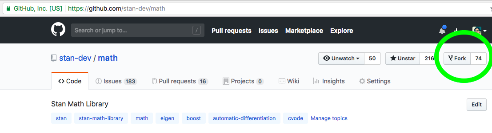

```{r setup, include=FALSE}
knitr::opts_chunk$set(echo = FALSE, comment = "")
```

## GitHub Resources

* `stan-dev/math`: [Adding a new function with known gradients](https://github.com/stan-dev/math/wiki/Adding-a-new-function-with-known-gradients)

* `stan-dev/stan`: [Contributing new functions to Stan](https://github.com/stan-dev/stan/wiki/Contributing-New-Functions-to-Stan)

* `stan-dev/stan`: [Developer process overview](https://github.com/stan-dev/stan/wiki/Developer-process-overview)

* `stan-dev/math`: [Developer doc](https://github.com/stan-dev/math/wiki/Developer-Doc)

## Placeholder slide for diagram
diagram will show something like: 

* Stan compiler source compiles with C++ compiler to Stan compiler
* Stan language model compiles with Stan compiler to C++ model
* C++ model includes Math library
* C++ model compiles with C++ compiler to program
* program is fed data and spits out draws

## Stan language is translated to a C++ model
* Creates a C++ model class with a known interface
* Model class is constructed with the data you pass in when you go to fit the model
* Primary entry point on the class is the `log_prob` function
    - Takes in parameter values and returns their log probability density (potentially up to a constant)
    
## Check out a model.hpp!
```
```

## The Stan<>C++ translator
* Called many things - compiler, transpiler, parser
* Also written in C++
* Lives in the Stan repo alongside the algorithms and services (`lang`)
* Functions are first defined in the Math library and then exposed in the Stan language

## C++ model is compiled into a program
* Includes the Math library - most or all functions and data types are defined there
* Compiled with the Stan algoirthms
* Some basic functionality for I/O lives in CmdStan, which presents the interface a user sees on the command line

## Current repo structure
CmdStan -> Stan -> Math

* Uses git submodules
* CmdStan has the Stan repo as a git submodule at `stan/`
* Stan has the Math library as a git submodule at `lib/stan_math`
* Math library directly includes (not as submodules) some external libraries like boost at `lib/`

## A Stan program
* `Matrix program(Matrix data) {...}`
    - Function from data to a sample of parameter draws typical given that data and model
* Compiled with a few algorithms that use the model density to find typical parameter draws
* Most of the complexity lies in the likelihood and is built using functions in the Math library

## Most of "Stan" is the Math library
* Provides users with many functions to express complicated likelihoods
* Autodiff system gives the algorithms the gradients they need automatically for any Stan or Math library code
* Split up into `stan` and `test`
* Then split by autodiff mode: `prim`, `rev`, `fwd`, `mix`
* Then further split by container type: `scal`, `arr`, `mat` (this is going away)
* Sometimes further split up by functionality: `err`, `fun`, `meta`, `prob`, ...

## Tests and continuous integration
* We use [googletest](https://github.com/google/googletest), a C++ testing framework for unit tests
    - tests end in `_test.cpp`
    - provides macros like `TEST(SuiteName, TestName)` and `EXPECT_EQ(actual, expected)`
* Test directory structure parallel to `src` stucture
* Run tests locally with `runTests.py` helper script on a directory or test
* Jenkins at http://d1m1s1b1.stat.columbia.edu:8080/
    - Specified in code, in a top-level file named `Jenkinsfile`
* [This wiki](https://github.com/stan-dev/stan/wiki/Supported-C---Compilers-and-Language-Features) tries to collate which OSes and toolchains are tested

## Developer process
0. For larger changes only: Discourse discussion and/or design review
1. Github issue describing the problem 
2. Add a description of the proposed technical solution to the github issue
3. Create a GitHub pull request
4. [Code Review](https://github.com/stan-dev/math/wiki/Developer-Doc#code-review-guidelines)
5. Merge

## Setting up GitHub
* Create an account
* (optional) [Set up SSH keys](https://help.github.com/articles/connecting-to-github-with-ssh/)
* Fork repo(s) from stan-dev
* `git clone --recursive <cmdstan repo>`
* Add your fork as a remote on the repo you care about

## Clone CmdStan
```{r, out.width = "100%"}
knitr::include_graphics("img/clone cmdstan.png")
```

## Fork Math repo
```{r, out.width = "100%"}

```


## My fork 


## Set up fork as remote in local clone of CmdStan
```
$ git remote -v
origin	git@github.com:stan-dev/math.git (fetch)
origin	git@github.com:stan-dev/math.git (push)
$ git remote add sean git@github.com:seantalts/math.git
$ git remote -v
origin	git@github.com:stan-dev/math.git (fetch)
origin	git@github.com:stan-dev/math.git (push)
sean	git@github.com:seantalts/math.git (fetch)
sean	git@github.com:seantalts/math.git (push)
```

## Creating a PR
Fairly standard open source flow:

1. (optional) create a branch
1. write code, tests, and doc
1. run appropriate checks - cpplint, appropriate unit tests, (optional) `clang-format`
1. add files
1. commit with a [message about what you were trying to accomplish](https://chris.beams.io/posts/git-commit/) 
1. `git push origin <branchname>`
1. open PR on appropriate `stan-dev` repo

## Creating a branch
```
$ git checkout -b descriptive-branch-name
Switched to a new branch 'descriptive-branch-name'
```

## Running the checks
1. `python runTests.py -j<num_cores> path/to/test.cpp /path/to/test/dir`
1. `make cpplint` - runs a python script that [checks style](https://github.com/stan-dev/stan/wiki/Coding-Style-and-Idioms)

## Autoformatting
1. (optional) [Auto-formatting - git hook, editor plugin](https://github.com/stan-dev/stan/wiki/Coding-Style-and-Idioms#clang-format)


## A complicated example
```
$ cd <math clone>
$ find . -name operands_and_partials.hpp

./stan/math/fwd/mat/meta/operands_and_partials.hpp
./stan/math/fwd/scal/meta/operands_and_partials.hpp
./stan/math/prim/mat/meta/operands_and_partials.hpp
./stan/math/prim/scal/meta/operands_and_partials.hpp
./stan/math/rev/mat/meta/operands_and_partials.hpp
./stan/math/rev/scal/meta/operands_and_partials.hpp
```

## Some tests from the example
```
$ cd ~/scm/cmdstan/stan/lib/stan_math
$ find . -name operands_and_partials_test*
./test/unit/math/fwd/mat/meta/operands_and_partials_test.cpp
./test/unit/math/fwd/scal/meta/operands_and_partials_test.cpp
./test/unit/math/mix/mat/meta/operands_and_partials_test.cpp
./test/unit/math/prim/scal/meta/operands_and_partials_test.cpp
./test/unit/math/rev/mat/meta/operands_and_partials_test.cpp
```

## Google test
`test/unit/math/rev/mat/meta/operands_and_partials_test.cpp`
```{cpp, eval=FALSE, echo=T}
TEST(AgradPartialsVari, OperandsAndPartialsVec) {
  ...
  vector_d d_vec(4);
  operands_and_partials<vector_d> o3(d_vec);
  EXPECT_EQ(6, sizeof(o3));
  ...
  EXPECT_FLOAT_EQ(10.0, v.val());
  EXPECT_FLOAT_EQ(10.0, grad[0]);
}

```

## Add, commit, push
```
$ git add test/unit/math/rev/mat/meta/operands_and_partials_test.cpp
$ git commit -m "Informative message..."
$ git push sean descriptive-branch-name
```

## PR step 1
```{r, out.width = "100%"}
knitr::include_graphics("img/PR1.png")
```

## PR step 2
```{r, out.width = "100%"}
knitr::include_graphics("img/PR2.png")
```

## PR step 3
```{r, out.width = "100%"}
knitr::include_graphics("img/PR3.png")
```

## Stan release process
1. Pull requests ask for code to be added to the `develop` branch
1. When creating a release, we choose a point in time along the `develop` branch and tag it as a certain release
1. We then merge that tag into the `master` branch, such that `master` is always stable
1. (Additional process for hotfixes to already-released code)
