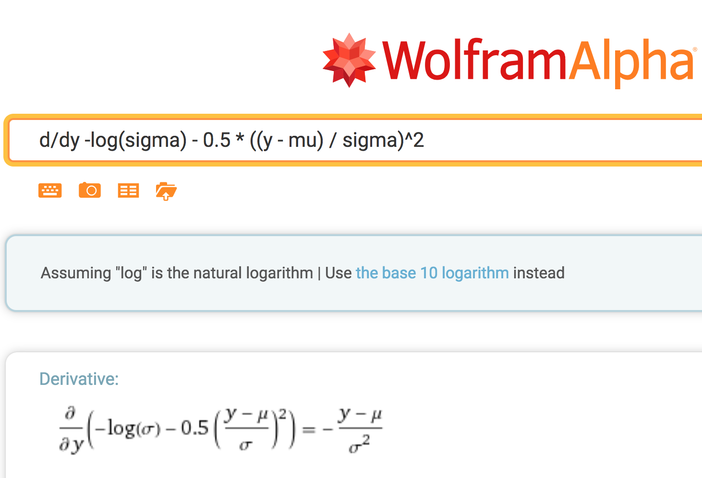

<style>
li {
  font-family: verdana, lucida sans unicode;
  font-size: 22px;
  line-height: 1.4em;
}
pre {
  font-family: lucida console, monaco, menlo;
  font-size: 19px;
  line-height: 1.5em;
  font-weight: 500;
}
tt {
  font-family: monaco; lucida console;
  font-size: 22px;
}
code {
  font-family: monaco; lucida console;
  font-size: 22px;
}
</style>

```{r echo = FALSE, warning = FALSE}
library(knitr)
library(ggplot2)

knitr::opts_knit$set(cache = TRUE)
```

## Best and Worst Part of Stan?

* What are the best and worst decisions you made regarding the implementation of Stan?
    - Worst decision: using C++
    - Best decision: using C++

## Why C++?

* It's not the easiest language in the world
    - the spec is incomplete by design so compilers vary
    - it's been a moving target from C++03 to C++20
    - low-level control makes it dangerous
* But it's very powerful
    - whole new language with C++11 and beyond
    - decent matrix and math libs (like Fortran, unlike all else)
    - control memory for autodiff
    - template overloads for autodiff
    - static evaluation of branchpoints (template programs)
    - elimination of intermediates (expression templates)
    - native in-memory communication with Python and R
    
## Documentation

* `stan-dev/math`: [Adding a new function with known gradients](https://github.com/stan-dev/math/wiki/Adding-a-new-function-with-known-gradients)

* `stan-dev/stan`: [Contributing new functions to Stan](https://github.com/stan-dev/stan/wiki/Contributing-New-Functions-to-Stan)

* `stan-dev/stan`: [Developer process overview](https://github.com/stan-dev/stan/wiki/Developer-process-overview)


## Coding a distribution in Stan

- Use the Stan language to code the normal log pdf
    - use `_lpdf` suffix to enable sampling notation
- Place in file `my-normal.stan`    

```stan
functions {
  real my_normal_lpdf(real y, real mu, real sigma) {
    return - 0.5 * log(2 * pi())          // params: { }
           - 2 * log(sigma)               // params: { sigma }
           - 0.5 * ((y - mu) / sigma)^2;  // params: { y, mu, sigma }
  }
}
parameters { 
  real y;
}
model {
  y ~ my_normal(0, 3.2);
}
```

## What's missing?

- Input validation!

- Implement in Stan with the `reject` function

```stan
if (sigma < 0 || is_nan(sigma) || is_inf(sigma))
  reject("sigma must be finite, positive, found sigma = ", sigma);

if (is_nan(y) || is_inf(y))
  reject("y must be finite, found y = ", y);

if (is_nan(mu) || is_inf(mu))
  reject("mu must be finite, found mu = ", mu);
```

## Restrictions on Stan functions

* Not polymorphic---they work for a single signature
    - can't duplicate library function vectorization
    - overloading is coming, but will require multiple definitions
    
* No traits branching
    - can't skip constant terms determined by type analysis
    

## Loading RStan and compiling

```{r cache = TRUE}
library(rstan)
model <- stan_model("my-normal.stan")
```

## Fit the model

```{r cache = TRUE}
fit <- sampling(model)
```

## Summarize the posterior
```{r cache = TRUE}
print(fit)
```

## Coding the distribution in C++

- Like Stan, but with explicit templates and references
- Template `y` & assume `mu` and `sigma` are `double`
    - `int` promoted to `double` in C++ and to `real` in Stan
- Name resolution
    - `log(double)` found through `using std::log`
    - `log(var)`  through *argument dependent lookup*

```c++
template <typename T>
double my_normal(const T& y, double mu, double sigma) {
  using std::log;  // allow std::log as candidate for log(sigma)
  return - 0.5 * log(2 * pi())
    - 2 * log(sigma)
    - 0.5 * ((y - mu) / sigma)^2;
}
```

## Includes and main

* Need some includes:
```c++
#include <stan/math/rev/mat.hpp>    // Stan math with gradients
#include <iostream>                 // C++ I/O
```

* The `main()` provides a runnable example
```c++
int main() {
  stan::math::var y = 1.2;  // independent var
  double mu = 0.3;          // constants
  double sigma = 0.5;
  stan::math::var lp        // dependent var
    = my_normal(y, mu, sigma);
  lp.grad();                // propagate derivatives
  std::cout << "val = " << lp.val()
            << "; d.val/d.y = " << y.adj() << std::endl;
}
```

## Reverse-mode autodiff: forward pass

* Build up (directed acyclic) expression graph in forward pass
    - each node is an expression with arrows to operands
    - autodiff variable `stan::math::var` for each $v_n$
    - arena-based node memory collected after gradients

<center style="margin:1em 0 0 0">

</center>

## Reverse-mode autodiff: reverse pass

*  Calculates adjoint for each node in reverse pass
    - adjoint is derivative of result w.r.t. expression
    - start with result adjoint = 1 (because $\frac{\mathrm{d}}{\mathrm{d}y}y = 1$)
    - for each node in topological order from root
```c++
adjoint[operand] += adjoint[result] * partial_result_wrt_operand;
```
*  Gradient is sequence of adjoints of inputs (independent vars)

* Time and space complexity both linear in graph size
    - times the cost of partial derivatives of each operation
    - which is usually constant in number of operands

* Slowness stems from interpretation (virtual calls)


## Custom derivative implementation

* Each `var` points to `vari`;  *roughly*:

```c++
struct var {
  vari* vi_;  // pointer to impl
};
```

* Each `vari` holds a value, adjoint, and implements a `chain()` method to propagate derivatives; *roughly*:

```c++
struct vari {
  double val_;  // values
  double adj_;  // adjoints
  vari(double val, double adj = 0) : val_(val), adj_(adj) { }
  virtual void chain() { }  // propagate derivs
};
```

## Simple Example of vari

* $\frac{\partial}{\partial a} (a \times b) = b \ \ \ \ \ \ \frac{\partial}{\partial b} (a \times b) = a$

```c++
struct multiply_vari : public vari {
  vari* op1_, op2_;
  multiply_vari(vari* op1, vari* op2)
    : vari(op1.val_ * op2.val_), op1_(op1), op2_(op2) { };

  void chain() {
    // operand adjoint += partial w.r.t. operand * result adjoint
    op1_->adj_ += op2_->val_ * this->adj_;
    op2_->adj_ += op1_->val_ * this->adj_;
  }
}
```
```c++
var operator*(const var& a, const var& b) {
  return var(new vari*(a.vi_, b.vi_));
}
```    

## Now lets do the normal distribution

* Need $\frac{\partial}{\partial y} \mathsf{Normal}(y \mid \mu, \sigma)$
* [Wolfram Alpha](http://wolframalpha.com) is way less error prone at derivatives than me
 
<center style="margin:1em 0 0 0">

</center>

## Normal vari for first argument

```c++
struct my_normal_vari : public vari {
  vari* y_;  double mu_, sigma_; 
  my_normal_vari(vari* y, double mu, double sigma)
    : vari(my_normal(y.val_, mu, sigma)),  // double only
      y_(y), mu_(mu), sigma_(sigma) { }
  void chain() {
      
  }
};
```


