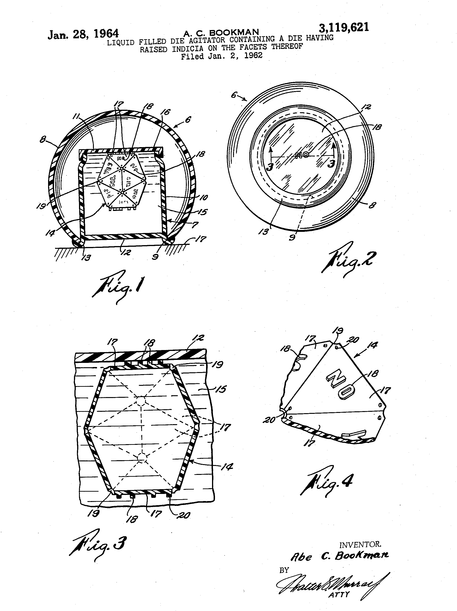

<style type="text/css">
.table { width: 40%; }
</style>
### Using a Categorical Distribution to Roll the Dice

Definition from [the wikipedia](https://en.wikipedia.org/wiki/Categorical_distribution) (abridged):

> A categorical distribution describes the possible results of a random variable that can take on one of $K$
> possible outcomes (often referred to as categories),
> with the probability of each outcome separately specified.
> There is no innate underlying ordering of these outcomes,
> but numerical labels $1$ to $K$ are often used for convenience in describing the distribution.
> The parameters specifying the probabilities of each possible outcome must be in the range $0$ to $1$
> and must sum to $1$.

> The categorical distribution is the generalization of the Bernoulli distribution for a categorical random variable,
> i.e. for a discrete variable with more than two possible outcomes, such as the roll of a die. 

The probability mass function for a categorical random variable $X$
which has vector of probabilities $\theta$ is:

> $p(\, x=i \, \vert \, \theta \,) = {\theta}_i$

Stan provides the function `categorial_rng` which
takes as its argument a $K$-simplex distribution parameter $\theta$
and generates a categorical variate,
i.e., an integer $x$ in $\{ 1,\ldots, \ K \}$.
This function may only be used in generated quantities block.

### Nice Dice:  the Platonic Solids

More from [the wikipedia](https://en.wikipedia.org/wiki/Platonic_solid):

> In three-dimensional space, a Platonic solid is a regular, convex polyhedron.
> It is constructed by congruent, regular, polygonal faces
> with the same number of faces meeting at each vertex.

There are only 5 polyhedrons that meet these criteria:

* tetrahedron (4 faces)
* cube (6 faces)
* octahedron (8 faces)
* dodecahedron (12 faces)
* icosahedron (20 faces).

These are good shapes for dice, since there is an equal chance for any side to land up.
Therefore we can model the vector of outcome probabilities $\theta$ for a fair die
in the shape of a platonic solid 
with $N$ faces as an $N$-length simplex where all entries have probability $\frac{1}{N}$.

\pagebreak

### Example:  the Magic 8-Ball

At the heart of every true Magic 8-Ball is a 20-sided die.

{width="50%"}

We can easily simulate the behavior of the Magic 8-Ball using
Stan's `categorical_rng` function.
We use Stan's `print` function to print out the message
corresponding to each outcome.  (Note: intended use of `print` function
is for debugging purposes.)

The following is the abridged version of Stan program `gen_magic8.stan`:

```
// simulate Magic 8-Ball
transformed data {
  vector[20] theta = rep_vector(1.0 / 20.0, 20);
}
generated quantities {
  int ans = categorical_rng(theta);
  if (ans == 1) print("It is certain");
  if (ans == 2) print("It is decidedly so");
  if (ans == 3) print("Without a doubt");
...
  if (ans == 18) print("My sources say no");
  if (ans == 19) print("Outlook not so good");
  if (ans == 20) print("Very doubtful");
}
```
\pagebreak

### RStan workflow 

#### `stan`

The RStan function `stan` generates a sample consisting of a set of draws given a Stan model (and data, as needed).

* many control parameters
* returns a `stanfit` object
* default parameters return a sample consisting of 4000 draws, (4 chains, 1000 draws per chain)

The data generating model `gen_magic8.stan` has no parameters,
therefore, `stan` function must be invoked with `algorithm="Fixed_param"`:
```
> fit_8ball = stan(file="gen_magic8.stan", algorithm="Fixed_param")
```

#### `print(<stanfit>)`

The functions `print` and `summary` provide information about the sample and the controls used to generate it.
It provides summary statistics for parameters and quantities of interest defined in the model.
Here, the generated quantity `ans` is the outcome of one roll of a 20-sided die:
```
> print(fit_8ball)
Inference for Stan model: gen_magic8.
4 chains, each with iter=2000; warmup=1000; thin=1; 
post-warmup draws per chain=1000, total post-warmup draws=4000.

      mean se_mean  sd 2.5% 25% 50% 75% 97.5% n_eff Rhat
ans  10.49    0.09 5.7    1   6  11  15    20  3794    1
```

#### `extract`, `as.array`, `as.matrix`, `as.data.frame`

The convenience functions `extract`, `as.array`, `as.matrix`, `as.data.frame` retrieve
the individual parameters and quantities of interest defined in the model as R objects.
To access the generated quantity `ans` as a single vector of 4000 outcomes, use the `as.array` accessor.
```
> a_rolls = as.vector(as.array(fit_8ball, pars=c("ans")))

# check vector length (sample size)
> length(a_rolls)
[1] 4000

# bin the outcomes
> cts = as.vector(table(a_rolls))
> cts
 [1] 198 195 192 169 216 222 198 213 185 198 226 222 185 212 196 200 185 206 181 201

# divide counts by total to retrieve p(theta)
> thetas = cts/length(a_rolls)
> thetas
 [1] 0.04950 0.04875 0.04800 0.04225 0.05400 0.05550 0.04950 0.05325 0.04625 0.04950 0.05650 0.05550
[13] 0.04625 0.05300 0.04900 0.05000 0.04625 0.05150 0.04525 0.05025
```

\pagebreak

### Exercise 1:  Roll a single fair dice.

* Write a program `gen_roll_d6.stan` to simulate one roll of a fair 6-sided die.
	+ Use RStan function `stan` to generate a sample consisting of 4000 draws
	+ Get the vector of all 4000 outcomes
	+ Bin the outcomes, retrieve observed values for parameter `theta`

* Generalize this to program `gen_roll_platonic.stan` to simulate one roll of any platonic solid.

### Exercise 2: load the die.

* Modify program `gen_roll_d6.stan` so that there is a higher chance of rolling a 6.
	+ Use RStan function `stan` to generate a sample consisting of 4000 draws
	+ Get the vector of all 4000 outcomes
	+ Bin the outcomes, retrieve observed values for parameter `theta` - do they correspond to your loading of the die?

### Exercise 3: generate sum of multiple rolls

* Write a Stan program which generates the sum of 3 rolls of a fair, 6-sided die.

* Write a Stan program which generates the sum of the best 3 out of 4 rolls of a fair, 6-sided die.

* For each model:
	+ Use RStan function `stan` to generate a sample consisting of 4000 draws for each model
	+ Get the vector of all 4000 outcomes
	+ Use R function `hist` to visualize the resulting distribution of totals.


