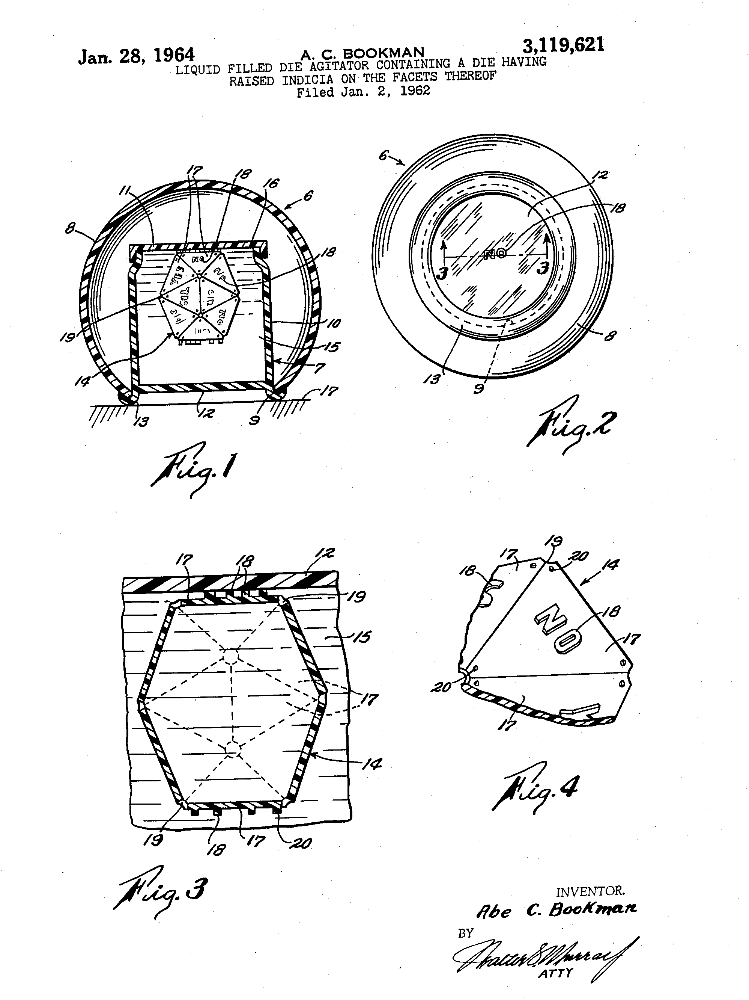

<style type="text/css">
.table { width: 40%; }
</style>
### Using a Categorical Distribution to Roll the Dice

Definition from [the wikipedia](https://en.wikipedia.org/wiki/Categorical_distribution) (abridged):

> A categorical distribution describes the possible results of a random variable that can take on one of $K$
> possible outcomes (often referred to as categories),
> with the probability of each outcome separately specified.
> There is no innate underlying ordering of these outcomes,
> but numerical labels $1$ to $K$ are often used for convenience in describing the distribution.
> The parameters specifying the probabilities of each possible outcome must be in the range $0$ to $1$
> and must sum to $1$.

> The categorical distribution is the generalization of the Bernoulli distribution for a categorical random variable,
> i.e. for a discrete variable with more than two possible outcomes, such as the roll of a die. 

The probability mass function for a categorical random variable $X$
which has vector of probabilities $\theta$ is:

> $p(\, x=i \, \vert \, \theta \,) = {\theta}_i$

Stan provides the function `categorial_rng` which
takes as its argument a $K$-simplex distribution parameter $\theta$
and generates a categorical variate,
i.e., an integer $x$ in $\{ 1,\ldots, \ K \}$.
This function may only be used in generated quantities block.

### Nice Dice:  the Platonic Solids

More from [the wikipedia](https://en.wikipedia.org/wiki/Platonic_solid):

> In three-dimensional space, a Platonic solid is a regular, convex polyhedron.
> It is constructed by congruent, regular, polygonal faces
> with the same number of faces meeting at each vertex.

There are only 5 polyhedrons that meet these criteria:

- tetrahedron (4 faces)
- cube (6 faces)
- octahedron (8 faces)
- dodecahedron (12 faces)
- icosahedron (20 faces).

These make good dice, since there is an equal chance for any side to land up.
Therefore the vector of probabilities for a fair dice with $N$ faces
is an $N$-length simplex where all entries have probability $\frac{1}{N}$.

\pagebreak

### Example:  the Magic 8-Ball

{width=50%}

At the heart of every true Magic 8-Ball is a 20-sided die.
We can easily simulate the behavoir of the Magic 8-Ball using
Stan's `categorical_rng` function.
We use Stan's `print` function to print out the message
corresponding to each outcome.
The following is the abridged version of Stan program `gen_magic8.stan`:

```
// simulate Magic 8-Ball
transformed data {
  vector[20] theta = rep_vector(1.0 / 20.0, 20);
}
generated quantities {
  int a = categorical_rng(theta);
  if (a == 1) print("It is certain");
  if (a == 2) print("It is decidedly so");
  if (a == 3) print("Without a doubt");
...
  if (a == 18) print("My sources say no");
  if (a == 19) print("Outlook not so good");
  if (a == 20) print("Very doubtful");
}
```
\pagebreak

### Exercise 1:  Roll a single fair dice.

- Write a program `gen_roll_d6.stan` to simulate one roll of a fair 6-sided die.

- Generalize this to program `gen_roll_platonic.stan` to simulate one roll of any platonica solid.

To check your work using RStan:


### Exercise 2: load the die.

- Modify program `gen_roll_d6.stan` so that there is a higher chance of rolling a 6.

### Exercise 3: generate best 3 out of 4 rolls of a fair, 6-sided die

- Write a Stan program which generates the sum of the best 3 out of 4 rolls of a fair, 6-sided die.

### Exercise 4: Expectation Estimation by Monte Carlo Simulation

