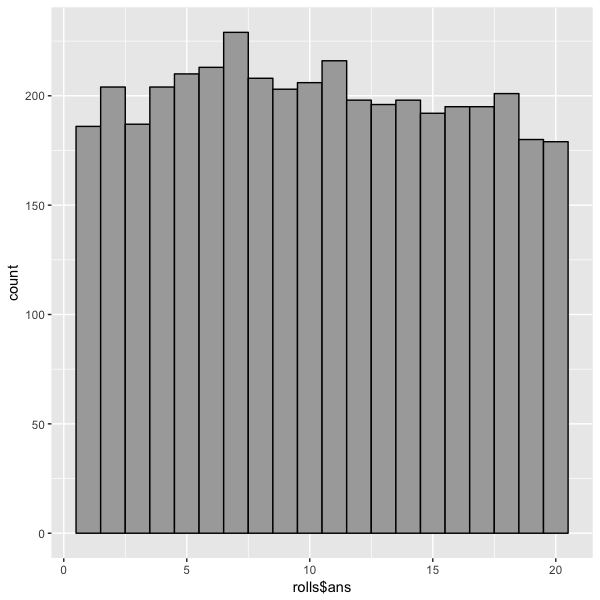

### Nice Dice:  the Platonic Solids

Definition of a Platonic solid from [the wikipedia](https://en.wikipedia.org/wiki/Platonic_solid):

> In three-dimensional space, a Platonic solid is a regular, convex polyhedron.
> It is constructed by congruent, regular, polygonal faces
> with the same number of faces meeting at each vertex.

There are only 5 polyhedrons that meet these criteria:

* tetrahedron (4 faces)
* cube (6 faces)
* octahedron (8 faces)
* dodecahedron (12 faces)
* icosahedron (20 faces).

These are good shapes for dice, since there is an equal chance for any side to land up.
Therefore we can model the vector of outcome probabilities $\theta$ for a fair die
in the shape of a platonic solid 
with $N$ faces as an $N$-length simplex where all entries have probability $\frac{1}{N}$.

### Nominal numbers

Definition of nominal numbers from [the wikipedia](https://en.wikipedia.org/wiki/Nominal_number):

> Nominal numbers or categorical numbers are numeric codes, meaning numerals used for labelling or identification only.
> The values of the numerals are irrelevant, and they do not indicate quantity, rank, or any other measurement.

### Flipping Coins:  the Bernoulli and Binomial Distributions

The Bernoulli distribution is used to model binary outcomes, e.g.
1/0,  yes/no, heads/talls, success/fail.

* parameter:  probability of success $\theta$, (a single number in $\left[0,1\right]$)
* data generating process is called a "Bernoulli trial"

The Binomial distribution is used to model the total number of successes
observed in $N$ Bernoulli trials

* parameters: $N$ number of trials, $\theta$ probability of success
* generalization of the Bernoulli from 1 trial to $N$ trials
* name:  "bi" == two, "nomial" == nominal numbers!

### Rolling Dice: the Categorical and Multinomial Distributions

The Categorical distribution is used to model a fixed number $K$ of discrete outcomes
when there is no innate underlying ordering of these outcomes,
e.g. possible outcomes from rolling a 6-sided die:  $\{ 1 \ldots 6 \}$.

* parameter:  $\theta$, a $K$-length vector of nonzero probabilities which sums to $1$.
* generalization of the Bernoulli from 2 outcomes to $K$ outcomes  (but just one trial)

The Multinomial distribution models the total number of outcomes for each of $K$ categories
observed in $N$ trials, where each category has a fixed success probability.

* parameters: $N$ number of trials, $\theta$ $K$-length vector of probability of success 
* generalization of the Binomial from 2 outcomes to $K$ outcomes

\pagebreak

### Example:  the Magic 8-Ball

At the heart of every true Magic 8-Ball is a 20-sided die.

{width="50%"}

Stan provides the function `categorial_rng` which
takes as its argument a $K$-simplex distribution parameter $\theta$
and generates a categorical variate,
i.e., an integer $x$ in $\{ 1,\ldots, \ K \}$.
This function may only be used in generated quantities block.

We can easily simulate the behavior of the Magic 8-Ball using
Stan's `categorical_rng` function.
We use Stan's `print` function to print out the message
corresponding to each outcome.  (Note: intended use of `print` function
is for debugging purposes.)

The following is the abridged version of Stan program `gen_magic8.stan`:

```
// simulate Magic 8-Ball
transformed data {
  vector[20] theta = rep_vector(1.0 / 20.0, 20);
}
generated quantities {
  int ans = categorical_rng(theta);
  if (ans == 1) print("It is certain");
  if (ans == 2) print("It is decidedly so");
...
  if (ans == 19) print("Outlook not so good");
  if (ans == 20) print("Very doubtful");
}
```
\pagebreak

### RStan Workflow for Exercises

This exercise set will require use of the following RStan and R commands:

#### `stan`

The RStan function `stan` generates a sample consisting of a set of draws given a Stan model (and data, as needed).

* many control parameters
* returns a `stanfit` object
* default parameters return a sample consisting of 4000 draws, (4 chains, 1000 draws per chain)

The data generating model `gen_magic8.stan` has no parameters,
therefore, `stan` function must be invoked with `algorithm="Fixed_param"`:
```
> fit_8ball = stan(file="gen_magic8.stan", algorithm="Fixed_param")
```

### compile model, then fit: `stan_model` `sampling` 

* function `stan_model` compiles a Stan program into a `stanmodel` object
* function `sampling` plugs in the data and returns the sample as a `stanfit` object 

#### `print(<stanfit>)`

The `print` function provides information about the sample and the controls used to generate it.
It prints summary statistics for parameters and quantities of interest defined in the model.
Here, the generated quantity `ans` is the outcome of one roll of a 20-sided die:
```
> print(fit_8ball)
Inference for Stan model: gen_magic8.
4 chains, each with iter=2000; warmup=1000; thin=1; 
post-warmup draws per chain=1000, total post-warmup draws=4000.

      mean se_mean  sd 2.5% 25% 50% 75% 97.5% n_eff Rhat
ans  10.49    0.09 5.7    1   6  11  15    20  3794    1
```

#### `extract`, `as.array`, `as.matrix`, `as.data.frame`

The convenience functions `extract`, `as.array`, `as.matrix`, `as.data.frame` retrieve
the individual parameters and quantities of interest defined in the model as R objects.
To access the generated quantity `ans` as a single vector of 4000 outcomes, use the `as.array` accessor.
```
> d20_outcomes = as.vector(as.array(fit_8ball, pars=c("ans")))

# tabulate the outcomes (number of times rolled "1" ... "20")
> cts = as.vector(table(d20_outcomes))
> cts
 [1] 198 195 192 169 216 222 198 213 185 198 226 222 185 212 196 200 185 206 181 201

# divide counts by total to retrieve p(theta)
> thetas = cts/length(d20_outcomes)
> thetas
 [1] 0.04950 0.04875 0.04800 0.04225 0.05400 0.05550 0.04950 0.05325 0.04625 0.04950 0.05650 0.05550
[13] 0.04625 0.05300 0.04900 0.05000 0.04625 0.05150 0.04525 0.05025
```

\pagebreak

### Visualization: histogram plots using R package `ggplot2`

[`ggplot2`](http://ggplot2.org) is a plotting system for R, based on the grammar of graphics.
To create the same histogram using `ggplot`, we used RStan's `as.data.frame` function
which creates a names column for each parameter or generated quantity variable.
We then pass this object into the ggplot function which creates a histogram plot:

```
library(ggplot2);
d20_outcomes = as.data.frame(fit_8ball, pars=c("ans"))
p2 = ggplot(data=d20_outcomes, aes(d20_outcomes$ans)) +
     geom_histogram(bins=20, colour = "black", fill = "darkgrey")
p2;
```

```{r, echo=FALSE, out.width = "55%"}
library(knitr)

```

\pagebreak

### Exercise 1:  Roll a single fair dice.

* Write a program `gen_d6.stan` to simulate one roll of a fair 6-sided die.
    + Use RStan function `stan` to generate a sample consisting of 4000 draws
    + Get the vector of all 4000 outcomes
    + Tabulate the outcomes, retrieve observed values for parameter `theta`

### Exercise 2: Load the die.

* Modify program `gen_d6.stan` so that there is a higher chance of rolling a 6.
    + Use RStan function `stan` to generate a sample consisting of 4000 draws
    + Get the vector of all 4000 outcomes
    + Tabulate the outcomes, retrieve observed values for parameter `theta` - do they correspond to your loading of the die?

### Exercise 3: Generate sum of multiple rolls for any platonic solid

The Stan language provides array operations which take arrays as input and produce single output values,
among these are `min`, `max`, `sum`, and many more (see the Stan Reference Manual, section "Array Operations").

* Generalize program `gen_d6.stan` to `gen_rollsN_facesK.stan` so that it outputs the sum of N rolls of any platonic solid with number of faces K.
    + Calculate the expectation of the sum of 4 rolls of a D6
    + Calculate the expectation of the sum of 2 rolls of a D12
    + Use histograms to visualize the distribution of the sums - compare and constrast

### Exercise 4: More games

* Write a Stan program `gen_best_3_of_4_d6.stan` which generates the sum of the best 3 out of 4 rolls of a fair, 6-sided die.

* Compare `gen_best_3_of_4_d6.stan` to the result of running `gen_rollsN_facesK.stan` for 3 rolls of a 6-sided die.
    + Use RStan function `stan` to generate a sample consisting of 4000 draws for each model
    + Get the vector of all 4000 outcomes
    + Use histograms to visualize the distribution of the sums - compare and constrast

